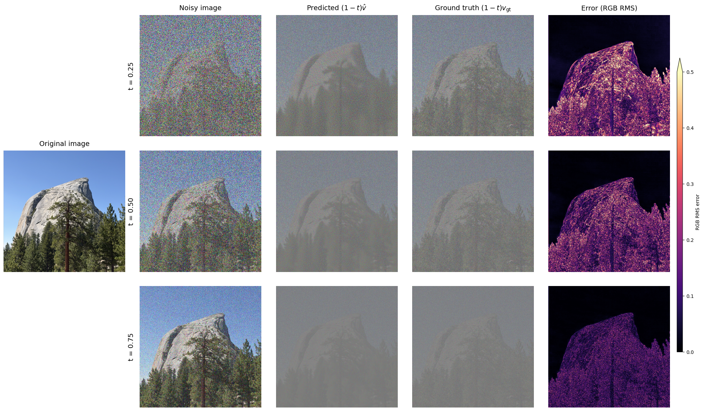

In this project, I explore how a pretrained flow model turns noise into images, and how changing its sampling procedure lets us edit photographs and create optical illusions. Part A uses **PixNerd-XXL-P16-T2I** to generate 512 × 512 images. I implement the sampling and guidance functions while keeping the pretrained model fixed.

The experiments below follow the [Fall 2026 Part A assignment](https://cal-cs180.github.io/fa26/hw/proj3-flow/parta.html). All results come from my saved notebook; the page explains the methods, compares their outputs, and discusses where they succeed or fall short.

# Part A: Exploring the Power of Flow Models

## Setup {#setup}

I ran the notebook on an NVIDIA L4 GPU with float32 model evaluation and integration states. The supplied preprocessing center-crops each input to a square, resizes it to 512 × 512, and normalizes RGB values to $[-1,1]$. Text prompts are converted into embeddings with the model's Qwen3 encoder.

I use a base seed of **180**, an Euler step size of **0.02**, and the generic prompt **“a high quality photo”** for the initial denoising and generation experiments. Sections 1.1–1.5 reuse the same Half Dome photograph and the same Gaussian noise tensor. Generation uses seeds 180–184, and the CFG comparison reuses those exact initial noises. Creative applications use CFG weight $w=7$ and an empty-string unconditional prompt.

The time convention matters throughout this project: **$t=0$ is noise and $t=1$ is a clean image**. Larger times preserve more of an input photograph. The model predicts a velocity field, which tells the sampler how to move the current image toward the clean endpoint.

## 1. Visualizing Training and Sampling {#training-and-sampling}

### 1.1 Constructing Noisy Training Inputs {#noisy-training-inputs}

I start with a photograph of Half Dome and construct noisy inputs by interpolating between the clean image $x_1$ and a Gaussian noise tensor $\epsilon$:

$$
x_t=(1-t)\epsilon+t x_1,\qquad \epsilon\sim\mathcal N(0,I).
$$

My `interpolate` function applies this weighted sum directly. This scales the photograph as well as adding noise. I sample $\epsilon$ once with seed 180 and reuse it at $t=0.25,0.50,0.75$, so the three inputs differ only in their interpolation weights. Endpoint checks confirm that $t=0$ returns the noise and $t=1$ returns the original image.



At $t=0.25$, the rock and trees are barely visible through the noise. At $t=0.50$, the mountain's outline is clear, but its surface is still heavily corrupted. By $t=0.75$, much more of the photograph is retained. I save these exact inputs for the next four experiments to keep the comparisons consistent.

### 1.2 Classical Denoising {#classical-denoising}

Before using the learned model, I try Gaussian blur as a baseline. Since interpolation scales the clean image by $t$, I first divide by $t$ to restore its amplitude, then apply a Gaussian filter:

$$
\hat x_1^{\mathrm{blur}}=G_\sigma\!\left(\frac{x_t}{t}\right),\qquad
\frac{x_t}{t}=x_1+\frac{1-t}{t}\epsilon.
$$

Dividing by $t$ does not remove the noise. Blur reduces it by averaging neighboring pixels, at the cost of also smoothing real detail. I test $\sigma\in\{1,2,4,8,16\}$ and select the candidate with the lowest mean squared error against the known original. The selected values are **8, 4, and 1** for the three times respectively.



The strongest blur makes the highly corrupted input more recognizable, but it also removes the fine rock texture and individual tree branches. At $t=0.75$, a small blur is enough to reduce much of the noise while preserving more detail. This baseline illustrates the noise–detail tradeoff: a local averaging filter cannot reconstruct structures that have been obscured.

### 1.3 One-Step Denoising {#one-step-denoising}

Next, I use the pretrained flow model to predict velocity at the current image and time. My `one_step_denoise` function extrapolates from that prediction to $t=1$:

$$
\hat x_1=x_t+(1-t)v_\theta(x_t,t,c).
$$

Here $c$ is the embedding of “a high quality photo.” Each estimate uses exactly one velocity prediction. The predicted tensor has the same shape, dtype, and device as the input.



The one-step estimates recover a plausible mountain and forest even at $t=0.25$, where Gaussian blur loses most of the detail. However, the low-time result changes the rock shape and looks smoother than the original. At higher times, the reconstruction becomes much closer to the input photograph. The model supplies a learned image prior, but one velocity prediction does not necessarily trace the full path accurately.

### 1.4 Visualizing Velocity {#visualizing-velocity}

To understand what the model adds, I compare its predicted update with the update that would exactly recover the original photograph. Because I retain the original noise, the ground-truth path velocity is known:

$$
v_{\mathrm{gt}}=x_1-\epsilon,\qquad
\Delta_{\mathrm{gt}}=(1-t)v_{\mathrm{gt}}=x_1-x_t.
$$

The predicted update is $\Delta_{\mathrm{pred}}=(1-t)v_\theta(x_t,t,c)$. My `velocity_diagnostics` function measures their difference at each pixel using RGB root-mean-square error:

$$
E_t=\sqrt{\operatorname{mean}_{\mathrm{RGB}}\left[(\Delta_{\mathrm{pred}}-\Delta_{\mathrm{gt}})^2\right]}.
$$

I calculate errors before any display scaling or clipping. All predicted and ground-truth updates use one shared symmetric RGB scale, with zero displayed as middle gray. The heatmaps use a shared linear magma scale from **0 to 0.5**; values above 0.5 saturate the display.

{width=2007 height=1174 fig-alt="Half Dome original beside velocity diagnostics at t=0.25, 0.50, and 0.75, with a common RMS error colorbar."}

[View the velocity diagnostics at full resolution](assets/velocity.webp).

The error maps are brightest over the rock and trees at $t=0.25$, where the model must infer more missing structure. The sky is easier to recover. The scaled updates and their errors become smaller as $t$ increases, consistent with the smaller correction needed near the clean endpoint. The shared update scale makes the higher-time panels look muted, but allows a fair comparison of their magnitudes.

### 1.5 Iterative Denoising with Euler Sampling {#euler-sampling}

Rather than extrapolating all the way to the endpoint with one prediction, I implement `euler_sample` to take small steps and recompute velocity after each update:

$$
x_{t+h}=x_t+h\,v_\theta(x_t,t,c).
$$

Starting from the saved $t=0.50$ input, I take **25 updates** with $h=0.02$. The sampler keeps float32 states and saves the initial image, every fifth update, and the final image. It also shortens the last step when necessary to end exactly at $t=1$. Constant-velocity checks cover a full trajectory, a half trajectory, and a start at $t=0.93$ that requires a shortened final step.



Noise gradually disappears as the trajectory progresses. The mountain and forest become sharper rather than simply being blurred. Below, I compare all three denoising methods on the **same $t=0.50$ noisy input**.



Gaussian blur removes noise but softens the trees and granite. One-step denoising reconstructs a plausible scene, although some texture is smoothed away. Euler sampling restores finer detail and more closely resembles the original. This makes sense because the learned velocity can change as the image evolves; recomputing it lets the sampler adjust its direction along the path.

### 1.6 Generating Images from Noise {#generating-from-noise}

The same Euler sampler can generate images without a source photograph. I initialize five independent Gaussian tensors with seeds **180–184** and integrate from $t=0$ to $t=1$, using 50 updates and “a high quality photo.” These are ordinary conditional samples, without extra CFG.



All five results favor human portraits, despite the prompt not specifying a person. Quality is uneven: seed 180 has a severely distorted face, seed 181 has unusual body proportions, and seed 183 has a muddled face and texture. Seeds 182 and 184 are more coherent. These examples show that a generic photo prompt can concentrate on a particular subject class, and that successful numerical sampling does not guarantee a convincing image.

## 2. Conditional Generation and Guidance {#conditional-generation}

### 2.1 Classifier-Free Guidance {#classifier-free-guidance}

I implement `cfg_velocity` by evaluating the same state and time with both the text condition and the empty-string condition. Their velocities are combined as:

$$
v_{\mathrm{cfg}}=v_c+w(v_c-v_u).
$$

I use $w=7$ and $h=0.02$. In this convention, $w=0$ reproduces ordinary conditional sampling; I check that identity in the notebook. To isolate the effect of guidance, I reuse the exact five initial noises from Section 1.6. Each pair below has the same seed, with ordinary conditional sampling on the left and CFG on the right.



The guided samples have much clearer facial features, more coherent anatomy, and stronger contrast. Seed 180 changes from a distorted face into a recognizable portrait, and seed 183 loses the smeared facial structure of its baseline. Guidance also changes the generated subjects rather than merely sharpening the same image.

Both sets still concentrate on portraits. These five pairs demonstrate a clear qualitative improvement in coherence, but are too small a sample to establish a quantitative change in diversity. The empty-string branch is the unconditional prediction; “a high quality photo” remains the conditional prompt.

## 3. Creative Applications {#creative-applications}

For all creative applications, I use Euler step size $h=0.02$, CFG weight $w=7$, and the empty-string unconditional condition. Image editing uses the seven starting times **0.02, 0.04, 0.06, 0.10, 0.14, 0.25, and 0.50**. Each editing sweep reuses seed 180 so that its starting times share the same noise realization.

### 3.1 Image-to-Image Editing {#image-to-image-editing}

My `edit` function first interpolates a source image with noise at a chosen starting time, then integrates the guided velocity field to $t=1$:

$$
x_{t_{\mathrm{start}}}=(1-t_{\mathrm{start}})\epsilon+t_{\mathrm{start}}x_1.
$$

Small starting times retain little of the image and allow large changes; larger starting times preserve more of the original. I begin with the supplied Campanile photograph and two of my own test inputs: Half Dome and a pixel-art chicken. The conditional prompt is “a high quality photo.”



The Campanile keeps its narrow tower silhouette through much of the sweep, although its surface becomes smooth and its top changes at low starting times. Half Dome is less stable: $t=0.02$ produces a portrait, $t=0.04$ resembles an angular building, and the rock formation returns at higher times. The pixel chicken also becomes people in orange clothing at low times, retaining some of its color palette without its identity. At $t\geq0.14$, its pixelated silhouette largely survives. A generic photo prompt is therefore not enough to preserve a particular subject when very little input information remains.

#### Editing Hand-Drawn and Web Images {#editing-drawings-and-web-images}

I repeat the procedure for an acrylic landscape from the web and two drawings: a snow-capped mountain and a flower. Each input is shown with all seven starting times.



The acrylic landscape becomes unrelated objects at very low times, then recovers its fields and mountains as more of the source is retained. The mountain drawing has a useful middle region: at $t=0.06$, the model turns its broad triangular shape into a realistic snowy mountain. Higher times preserve the flat illustration more strongly.

The flower behaves similarly. Its $t=0.02$ result is an unrelated face, but $t=0.06$ and $t=0.10$ produce more dimensional petals while keeping the basic flower layout. At $t=0.25$ and $t=0.50$, the result is close to the drawing. The most useful edit strength depends on the source: enough noise encourages a realistic reinterpretation, while too much can discard the subject altogether.

### 3.2 Text-Guided Image Editing {#text-guided-image-editing}

I now reuse the Campanile, Half Dome, and pixel chicken, replacing the generic photo prompt with a description of the desired edit. The sampling algorithm, guidance settings, starting times, and noise seed remain the same.



The lighthouse prompt gives the Campanile a clear target: low-time results are recognizable lighthouses beside the ocean, while the intermediate results retain the original tower's framing. By $t=0.25$, the source architecture begins to dominate again.

For Half Dome, low starting times generate an erupting volcano with lava and a large smoke plume. At $t=0.10$ and $t=0.14$, smoke rises from a rock formation that still resembles the original photograph. At $t=0.50$, most of the original scene remains.

The rooster prompt is especially effective for the pixel chicken. Low-time outputs become detailed rooster portraits while preserving the turquoise background. At $t=0.25$, a realistic eye and beak appear within a mostly pixelated silhouette. This intermediate result shows how text guidance and retained source information can pull the image toward different visual styles.

### 3.3 Visual Anagrams {#visual-anagrams}

To generate an image that reveals a different subject when turned upside down, I implement `visual_anagrams`. Let $F$ rotate both spatial axes by 180°. At each step, I predict guided velocities for the upright image and its rotated version, rotate the second prediction back, and average:

$$
\begin{aligned}
v_a&=v_{\mathrm{cfg}}(x_t,t,p_a),\\
v_b&=F\!\left(v_{\mathrm{cfg}}(F(x_t),t,p_b)\right),\\
v&=\frac{v_a+v_b}{2}.
\end{aligned}
$$

The averaged velocity is used in the Euler update. Rotating the second velocity back is essential: the two predictions must be expressed in the same orientation before combining them. I also check that applying $F$ twice returns the original tensor.



The waterfall/sailor pair uses the bright waterfall and surrounding canyon as features of the rotated face and beard. In the cabin/wolf pair, snowy shapes and dark pine trees form a second set of facial features when rotated. Both results use seed **181**. The rotated views are displayed alongside the upright images, so the illusion is visible without interacting with the page.

I selected these two prompt pairs after experimenting with alternative subjects. Their alternate interpretations are more recognizable than the weaker trials, which contained competing features or a faint second subject. Combining velocity fields gives both prompts influence, but does not guarantee that every prompt pair forms a convincing illusion.

### 3.4 Hybrid Images {#hybrid-images}

For `make_hybrids`, I combine low-frequency structure from one guided prediction with high-frequency detail from another:

$$
\begin{aligned}
v_a&=v_{\mathrm{cfg}}(x_t,t,p_a),\\
v_b&=v_{\mathrm{cfg}}(x_t,t,p_b),\\
v&=G_\sigma(v_a)+\left(v_b-G_\sigma(v_b)\right).
\end{aligned}
$$

Both predictions use the same image and time. I apply the provided Gaussian low-pass filter with **kernel size 265 and sigma 16** at 512 × 512, then use the composite velocity in each Euler update. Prompt $p_a$ supplies the distant structure; prompt $p_b$ supplies the close-up detail.



In the fox/forest hybrid, orange foliage and dark trunks provide the near-view scene, while their larger arrangement suggests a fox's face at a distance. For the elephant/ruins pair, stone blocks dominate the close view; the large dark openings and central vertical shape suggest the elephant's facial structure when detail is reduced. The fox/forest result uses seed **181**; elephant/ruins uses seed **298838**.

I show the actual full hybrid alongside **native 64- and 32-pixel thumbnails**, rather than enlarging the distant view. The separation is imperfect: some scenery remains visible at small scales, and the second interpretation takes a moment to resolve. The elephant's face is less immediately recognizable than the fox's, so I consider it a weaker result. These experiments illustrate that frequency separation can encourage a hybrid, while prompt choice still strongly affects its success.

## References {#references}

- [CS 180 Fall 2026: Project 3, Part A](https://cal-cs180.github.io/fa26/hw/proj3-flow/parta.html) — equations and deliverables.
- [Course starter notebook](https://github.com/hgaurav2k/cs180-hw3-student-notebooks/blob/main/parta_updated.ipynb) — model adapter and display helpers.
- [PixNerd-XXL-P16-T2I](https://huggingface.co/MCG-NJU/PixNerd-XXL-P16-T2I) — pretrained image model.
- [SDEdit](https://sde-image-editing.github.io/) — inspiration for image editing by noising and denoising.
- [Visual Anagrams](https://dangeng.github.io/visual_anagrams/) and [Factorized Diffusion](https://dangeng.github.io/factorized_diffusion/) — inspiration for the illusion experiments.
- [Wesley Zheng's project report](https://wkaiz.github.io/projects/cs180proj5.html) — reference for the Quarto page style and organization. The explanations and results here are based on my own flow-model experiments.
