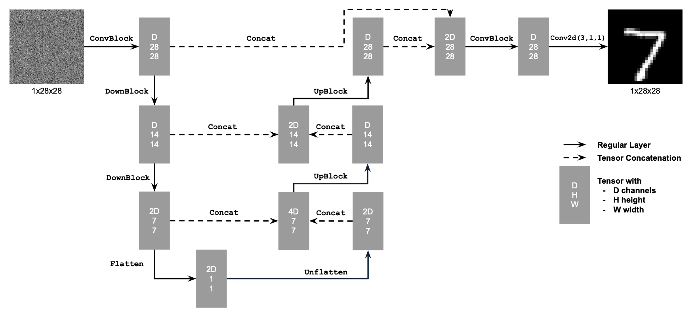
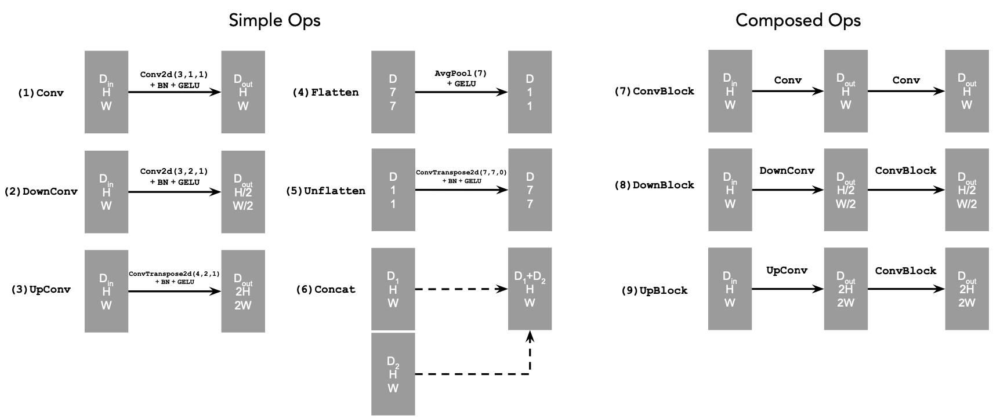
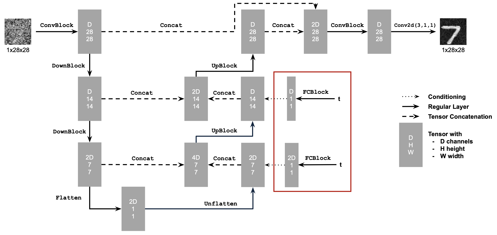
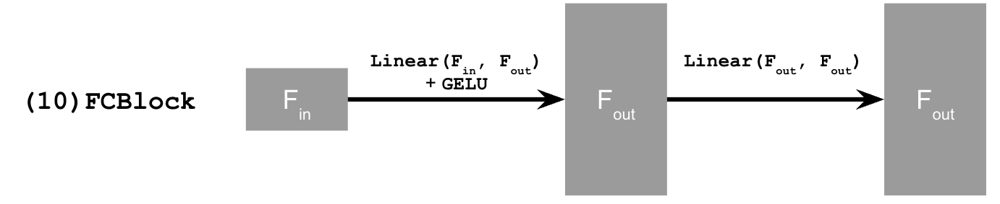
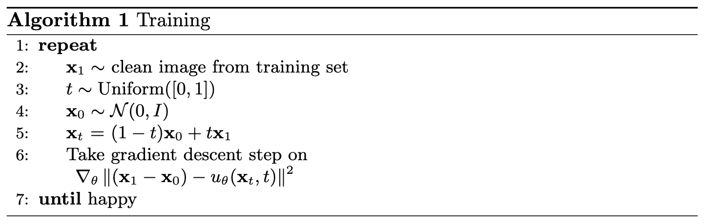
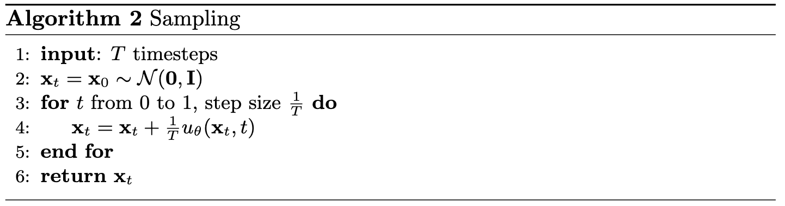
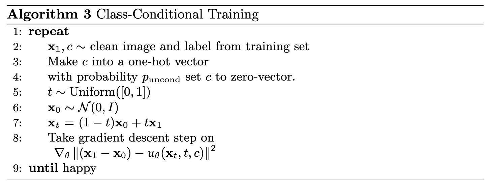
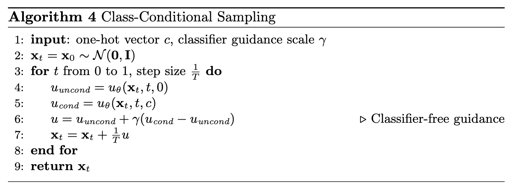

# Part A: Exploring the Power of Flow Models

## Setup {#setup}

For this project, I use the pretrained PixNerd-XXL-P16-T2I model to generate and edit 512 × 512 images. I ran the notebook on an NVIDIA L4 GPU in float32. Input images are center-cropped, resized, and normalized to $[-1,1]$; prompts are encoded using Qwen3.

The base seed is **180** and the Euler step size is **0.02**. I begin with “a high quality photo” and add classifier-free guidance later. Throughout this project, **$t=0$ is noise and $t=1$ is a clean image**.

## 1. Visualizing Training and Sampling {#training-and-sampling}

### 1.1 Constructing Noisy Training Inputs {#noisy-training-inputs}

I start with a photograph of Half Dome. My `interpolate` function constructs noisy inputs by mixing the clean image $x_1$ with Gaussian noise:

$$
x_t=(1-t)\epsilon+t x_1,\qquad \epsilon\sim\mathcal N(0,I).
$$

This scales the image as well as adding noise. I use the same noise tensor at $t=0.25,0.50,0.75$, and keep these inputs for Sections 1.2–1.5.



At $t=0.25$, the rock and trees are barely visible. The mountain's outline becomes clear at $t=0.50$, and much more of the photograph survives at $t=0.75$. Increasing time moves us closer to the original image.

### 1.2 Classical Denoising {#classical-denoising}

First, I try Gaussian blur as a baseline. I divide by $t$ to restore the image's amplitude before filtering:

$$
\hat x_1^{\mathrm{blur}}=G_\sigma\!\left(\frac{x_t}{t}\right).
$$

Dividing by $t$ also amplifies the noise, so blur is still needed. I test $\sigma\in\{1,2,4,8,16\}$ and select the lowest-MSE result against the original. The chosen values are **8, 4, and 1** for the three times.



Strong blur makes the highly corrupted input recognizable, but removes the granite texture and individual branches. At $t=0.75$, a small blur reduces noise while retaining more detail. The filter helps, but cannot reconstruct the structures it averages away.

### 1.3 One-Step Denoising {#one-step-denoising}

Next, I use the flow model with “a high quality photo.” My `one_step_denoise` function predicts the velocity once and extrapolates to the clean endpoint:

$$
\hat x_1=x_t+(1-t)v_\theta(x_t,t,c).
$$



Even at $t=0.25$, the model recovers a plausible mountain and forest. However, the rock shape changes and the scene looks smoother than the original. The higher-time estimates preserve more of the photograph. One prediction is useful, but may not follow the entire denoising path accurately.

### 1.4 Visualizing Velocity {#visualizing-velocity}

What is the model actually adding? Since I saved the original noise, I can compare its predicted update with the exact update needed to recover Half Dome:

$$
\begin{aligned}
\Delta_{\mathrm{pred}}&=(1-t)v_\theta(x_t,t,c),\\
\Delta_{\mathrm{gt}}&=(1-t)(x_1-\epsilon)=x_1-x_t.
\end{aligned}
$$

The error heatmap is the root-mean-square difference across RGB at each pixel:

$$
E_t=\sqrt{\operatorname{mean}_{\mathrm{RGB}}[(\Delta_{\mathrm{pred}}-\Delta_{\mathrm{gt}})^2]}.
$$

Errors are computed before display scaling. All update panels share a symmetric scale with zero at middle gray. All heatmaps share a linear magma scale from **0 to 0.5**, with larger errors clipped for display.



The largest errors occur over the rock and trees at $t=0.25$; the sky is easier to recover. The errors decrease as more source information is retained. The higher-time update panels look muted because they use the same scale while requiring a smaller correction.

### 1.5 Iterative Denoising with Euler Sampling {#euler-sampling}

Instead of jumping to the endpoint, `euler_sample` takes small steps and predicts a new velocity after each update:

$$
x_{t+h}=x_t+h\,v_\theta(x_t,t,c).
$$

Starting from the saved $t=0.50$ input, I take **25 updates** with $h=0.02$. Below are the initial state, every fifth update, and the final result. The last step is shortened when needed to reach $t=1$ exactly.



Noise gradually disappears while the mountain and forest become sharper. Here is the comparison with the original, Gaussian blur, and one-step denoising, all using the same noisy input:



Blur softens the trees and granite. One-step denoising recovers the scene, but smooths some texture. Euler sampling restores finer detail and looks closer to the original because it can adjust the predicted direction as the image changes.

### 1.6 Generating Images from Noise {#generating-from-noise}

The same sampler can generate images from scratch. I initialize Gaussian noise with seeds **180–184**, then take 50 Euler updates from $t=0$ to $t=1$ with “a high quality photo,” without extra guidance.



All five samples favor portraits, although the prompt does not specify a person. Quality is uneven: seed 180 has a distorted face, seed 181 has unusual body proportions, and seed 183 has muddled facial features. Seeds 182 and 184 are more coherent. The generic prompt leaves plenty of room for variation, but these samples still concentrate on a similar subject.

## 2. Conditional Generation and Guidance {#conditional-generation}

### 2.1 Classifier-Free Guidance {#classifier-free-guidance}

To improve generation, I implement `cfg_velocity` using conditional and empty-string predictions at the same image and time:

$$
v_{\mathrm{cfg}}=v_c+w(v_c-v_u).
$$

I use **$w=7$**, with $w=0$ corresponding to ordinary conditional sampling. Each pair below reuses the exact initial noise from Section 1.6: ordinary sampling on the left, CFG on the right.



CFG produces much clearer faces, more coherent anatomy, and stronger contrast. Seed 180 becomes a recognizable portrait, and seed 183 loses its smeared facial structure. Guidance also changes the subjects, rather than just sharpening the original outputs. Both sets remain mostly portraits; five pairs are not enough to measure a change in diversity.

## 3. Creative Applications {#creative-applications}

For these experiments, I use **$h=0.02$**, **$w=7$**, and the empty-string unconditional prompt. Every editing sweep uses seed 180 and starting times **0.02, 0.04, 0.06, 0.10, 0.14, 0.25, and 0.50**.

### 3.1 Image-to-Image Editing {#image-to-image-editing}

My `edit` function noises an input at the selected time, then integrates the guided velocity to $t=1$:

$$
x_{t_{\mathrm{start}}}=(1-t_{\mathrm{start}})\epsilon+t_{\mathrm{start}}x_1.
$$

Smaller starting times allow larger edits; larger times preserve more of the source. I use “a high quality photo” on the required Campanile image, Half Dome, and a pixel-art chicken.



The Campanile retains its tower silhouette, but becomes smooth and changes its top at low times. Half Dome is less stable: $t=0.02$ produces a portrait and $t=0.04$ resembles a building. The pixel chicken becomes people in orange clothing, retaining its palette but losing its identity. At higher times, both inputs return to their original forms.

#### Editing Hand-Drawn and Web Images {#editing-drawings-and-web-images}

I repeat the same procedure for an acrylic landscape from the web and two of my drawings: a snow-capped mountain and a flower.



The landscape becomes unrelated objects at low times, then recovers its fields and mountains. The mountain drawing works particularly well at $t=0.06$, becoming a realistic snowy peak. The flower gains more dimensional petals at $t=0.06$ and $t=0.10$. Higher times preserve the flat drawings. There is a useful middle region where the model reinterprets the image without completely losing its subject.

### 3.2 Text-Guided Image Editing {#text-guided-image-editing}

Now I replace the generic prompt with a description of the desired edit, using the same three inputs and sampling settings.



The lighthouse prompt gives the Campanile a clear target: low-time outputs are lighthouses beside the ocean, while intermediate results keep the tower's framing. At $t=0.25$, the source architecture begins to dominate again.

Half Dome becomes an erupting volcano at low times. At $t=0.10$ and $t=0.14$, smoke rises from a rock formation that still resembles the original. By $t=0.50$, most of the source scene remains.

The rooster prompt is especially effective. Low-time outputs become detailed rooster portraits while preserving the turquoise background. At $t=0.25$, a small, complete photographic rooster head appears embedded within the mostly pixelated silhouette. The edit is localized: most of the source's pixel-art structure remains.

### 3.3 Visual Anagrams {#visual-anagrams}

For `visual_anagrams`, I predict guided velocities for the upright image and a 180° rotation. I rotate the second prediction back, average the two, and take an Euler step:

$$
\begin{aligned}
v_a&=v_{\mathrm{cfg}}(x_t,t,p_a),\\
v_b&=F\!\left(v_{\mathrm{cfg}}(F(x_t),t,p_b)\right),\\
v&=(v_a+v_b)/2.
\end{aligned}
$$

Here $F$ flips both spatial axes. These two chosen prompt pairs use seed **181**:



The waterfall and surrounding canyon become the sailor's face and beard when rotated. In the cabin/wolf pair, the snow and pine trees form the wolf's facial features. These were more convincing than my weaker trials, which contained competing features or a faint second subject. The method gives both prompts influence, but prompt choice still matters.

### 3.4 Hybrid Images {#hybrid-images}

To make hybrids, I combine low-frequency velocity from one prompt with high-frequency velocity from another:

$$
\begin{aligned}
v_a&=v_{\mathrm{cfg}}(x_t,t,p_a),\\
v_b&=v_{\mathrm{cfg}}(x_t,t,p_b),\\
v&=G_\sigma(v_a)+v_b-G_\sigma(v_b).
\end{aligned}
$$

The composite velocity drives each Euler step. I use Gaussian blur with **kernel size 265 and sigma 16**. Prompt $p_a$ determines the distant structure, while $p_b$ provides close-up detail.



The fox/forest result uses seed **181**. Up close, orange foliage and dark trunks dominate; at a smaller size, their arrangement suggests a fox's face. The elephant/ruins result uses seed **298838**. Stone blocks form the near view, while the dark openings and central shape suggest an elephant when reduced.

I show native 64- and 32-pixel views alongside each full hybrid. The separation is imperfect: scenery remains visible, and the elephant is harder to recognize than the fox. Still, the results show how combining different frequency bands can make one image support two interpretations.

# Part B: Flow Matching on MNIST {#part-b}

In this part, I train a UNet from scratch on MNIST. I start with single-step denoising, then use flow matching to generate digits iteratively. Finally, class conditioning lets me request a specific digit.

## 1. Training a Single-Step Denoising UNet {#partb-single-step}

### 1.1 Implementing the UNet {#partb-unet}

The UNet downsamples the image, passes it through a bottleneck, and upsamples it again. Skip connections bring encoder features into the decoder to preserve local information.

<figure class="course-figure">

<figcaption>Unconditional UNet.</figcaption>
</figure>

<figure class="course-figure">

<figcaption>Simple and composed UNet operations.</figcaption>
</figure>

`Conv` changes channels while keeping resolution. `DownConv` halves the resolution, and `UpConv` doubles it. `Flatten` pools 7 × 7 features to 1 × 1; `Unflatten` expands them back. `Concat` joins features along the channel dimension.

### 1.2 Using the UNet to Train a Denoiser {#partb-noising}

I add Gaussian noise to clean MNIST digits, with pixels normalized to $[0,1]$:

$$
z=x+\sigma\epsilon,\qquad \epsilon\sim\mathcal N(0,I).
$$

The denoiser learns to reconstruct the clean image by minimizing mean squared error:

$$
L=\mathbb E_{z,x}\|D_\theta(z)-x\|^2.
$$

Below, each column keeps the same test digit and noise tensor. From top to bottom, the rows use **$\sigma=[0.0,0.2,0.4,0.5,0.6,0.8,1.0]$**.



#### 1.2.1 Training {#partb-denoiser-training}

I train on the shuffled MNIST training set for **five epochs** with **$\sigma=0.5$**, hidden dimension **128**, batch size **256**, and Adam learning rate **$10^{-4}$**. Each batch gets fresh noise. Here is the training loss:



The test results after **epochs 1 and 5** use the same noisy inputs. Each panel shows clean digits, noisy inputs, and predictions, from top to bottom.





#### 1.2.2 Out-of-Distribution Testing {#partb-ood}

The model was trained only at $\sigma=0.5$. I test its final checkpoint on **the same digit** at all seven noise levels, without retraining. Columns increase from $\sigma=0.0$ to $1.0$; the top row is the input and the bottom row is the prediction.



#### 1.2.3 Denoising Pure Noise {#partb-pure-noise}

Next, I train a new denoiser for five epochs using the same settings, but its input is **pure noise $z=\epsilon$**, independently paired with a clean target digit.





The outputs resemble blurry, centered averages rather than distinct digits. With MSE, the optimal prediction is the conditional mean. Since the noise and target are independent, this becomes the pixelwise mean of the training digits:

$$
D^*(z)=\mathbb E[x\mid z]=\mathbb E[x].
$$

Averaging many digit shapes explains why these outputs do not look like individual samples from digits 0–9.

## 2. Training a Flow Matching Model {#partb-flow-matching}

Flow matching learns how to move from noise to data, using a linear interpolation:

$$
x_t=(1-t)x_0+t x_1,\qquad x_0\sim\mathcal N(0,I),\quad t\in[0,1].
$$

The target velocity is $u(x_t,t)=x_1-x_0$, giving the objective

$$
L=\mathbb E_{x_0,x_1,t}\|(x_1-x_0)-u_\theta(x_t,t)\|^2.
$$

The network predicts **velocity**, with $t=0$ representing noise and $t=1$ representing a clean digit.

### 2.1 Adding Time Conditioning to UNet {#partb-time-conditioning}

I embed the scalar time $t$ with two fully connected blocks and multiply their outputs into the decoder features after `Unflatten` and the first `UpBlock`.

<figure class="course-figure">

<figcaption>Conditioned UNet. The flow model predicts velocity.</figcaption>
</figure>

<figure class="course-figure fc-figure">

<figcaption>FCBlock for conditioning.</figcaption>
</figure>

### 2.2 Training the UNet {#partb-time-training}

I follow the training algorithm below, using **ten epochs**, hidden dimension **64**, batch size **64**, and Adam starting at **$10^{-2}$**. The exponential scheduler steps after each epoch with decay factor $0.1^{1/10}$.

<figure class="course-figure algorithm-figure">

<figcaption>Algorithm 1 · Time-conditioned training.</figcaption>
</figure>



The recorded mean training MSE falls from **0.17787** at epoch 1 to **0.09141** at epoch 10.

### 2.3 Sampling from the UNet {#partb-time-sampling}

I use the sampling algorithm with **50 Euler steps**, starting from Gaussian noise.

<figure class="course-figure algorithm-figure">

<figcaption>Algorithm 2 · Time-conditioned sampling.</figcaption>
</figure>

These **40-sample grids** come from epochs **1, 5, and 10**, using the same initial noise with seed **180**. This model receives time conditioning only.







### 2.4 Adding Class Conditioning to UNet {#partb-class-conditioning}

I encode the requested digit as a **10-dimensional one-hot vector** and add two class FC blocks to condition the decoder on both the digit label and time.

During training, I replace the entire class vector with zeros **10% of the time**. This lets the same model make unconditional predictions for classifier-free guidance.

### 2.5 Training the UNet {#partb-class-training}

The class-conditioned model uses the same training settings as the time-only model, following the algorithm below with class dropout added:

<figure class="course-figure algorithm-figure">

<figcaption>Algorithm 3 · Class-conditioned training.</figcaption>
</figure>

Here is the training loss:



The recorded mean training MSE falls from **0.17394** at epoch 1 to **0.08463** at epoch 10.

### 2.6 Sampling from the UNet {#partb-class-sampling}

I use the class-conditioned sampler with **300 Euler steps** and classifier-free guidance at **$\gamma=5$**:

<figure class="course-figure algorithm-figure">

<figcaption>Algorithm 4 · Class-conditioned sampling.</figcaption>
</figure>

At epochs **1, 5, and 10**, each grid shows **four instances of each digit**. Columns are requested classes **0–9**. All checkpoints use the same initial noise, seed **180**, step count, and guidance scale.







#### Removing the Learning Rate Scheduler {#partb-no-scheduler}

To compensate for removing exponential decay, I retrain with a **constant Adam learning rate of 0.003**, reduced from the baseline's initial 0.01. The seed, data order, architecture, batch size, ten epochs, and class dropout stay the same. No gradient clipping is used.





Compare this grid with the scheduled epoch 10 samples above. Both use identical initial noise, requested classes, 300 Euler steps, and guidance scale 5.

The no-scheduler samples show recognizable digits matching their requested classes, with visual quality comparable to the baseline. Final mean training MSE is **0.08645** without the scheduler versus **0.08463** with it, about **2.2% higher**. For this run, the lower constant learning rate maintains similar visual quality.
